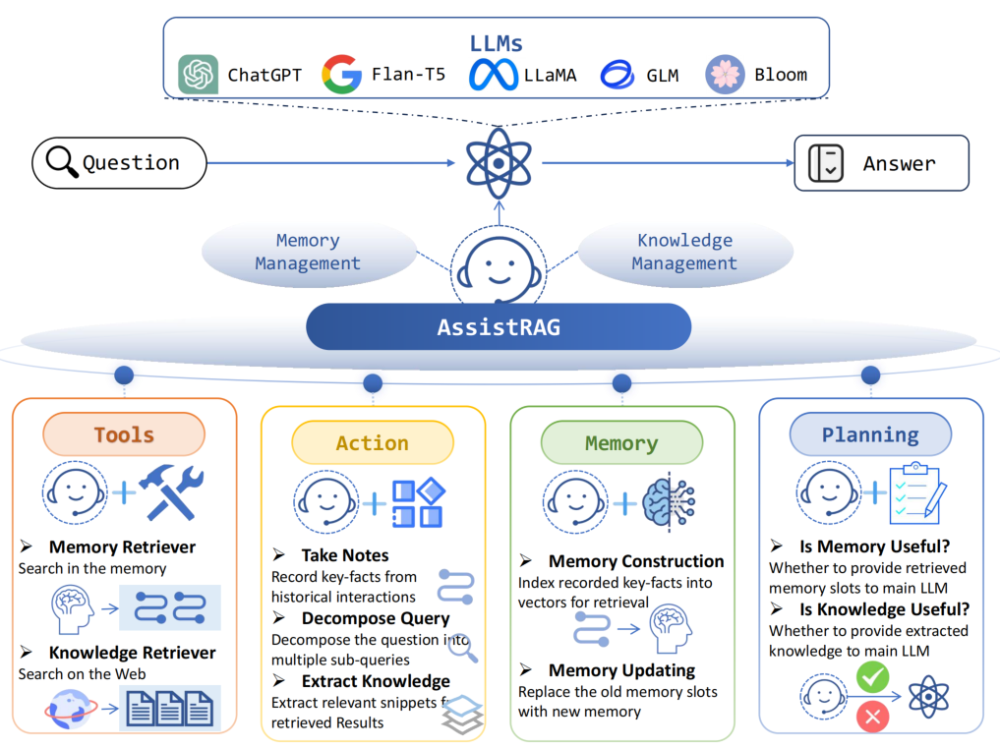

# AssistRAG: Boosting the Potential of Large Language Models with an Intelligent Information Assistant

This repository contains the official code and documentation for our NeurIPS 2024 poster paper, titled "[Boosting the Potential of Large Language Models with an Intelligent Information Assistant](url)."



## Overview
AssistRAG introduces a framework to enhance large language models (LLMs) with an intelligent information assistant that optimizes performance on specific tasks through multi-stage training. Our approach leverages functions like knowledge extraction, note-taking, and query decomposition to expand LLM capabilities.

## Requirement
For model training and inference, please install following packages:
```
transformers >= 4.40.0
torch >= 2.0.1
```

For passage and memory retrieval, please downloading following models:
```
https://huggingface.co/BAAI/llm-embedder
```

## Training Data Download
The training data for AssistRAG, including modules for knowledge extraction, note-taking, and query decomposition, can be downloaded [here](https://drive.google.com/file/d/1KdO7tT7zkON9FDeJT606Ksv2-HBPYRzP/view?usp=sharing).

## Training Phases

### 1. Supervised Fine-Tuning (SFT) Training
The first stage in training, known as the Assistant Learning Stage, uses code adapted from [LLaMA-Factory](https://github.com/hiyouga/LLaMA-Factory). Below is the recommended configuration:

```yaml
# Model
model_name_or_path: THUDM/ChatGLM3-6B

# Training Method
stage: dpo
do_train: true
finetuning_type: lora
lora_target: all
pref_beta: 0.1
pref_loss: sigmoid  # choices: [sigmoid (dpo), orpo, simpo]

# Dataset
dataset: sft_assistrag
template: llama3
cutoff_len: 2048
max_samples: 1000
overwrite_cache: true
preprocessing_num_workers: 16

# Output Configuration
output_dir: saves/assistrag-ChatGLM3-6B
logging_steps: 10
save_steps: 500
plot_loss: true
overwrite_output_dir: true

# Training Parameters
per_device_train_batch_size: 4
gradient_accumulation_steps: 8
learning_rate: 2.0e-5
num_train_epochs: 2.0
lr_scheduler_type: cosine
warmup_ratio: 0.1
bf16: true
ddp_timeout: 180000000

# Evaluation
val_size: 0.1
per_device_eval_batch_size: 1
eval_strategy: steps
eval_steps: 500
```

### 2. DPO Data Generation
To generate preference alignment data, execute the `dpo.sh` script. This will generate preference data required for the next training stage.

An Example of using LLaMA2-chat-7B as the main LLM can be downloaded can be downloaded [here](https://drive.google.com/file/d/1ZTskV0saERntC4v7h3LOIjVD7vPk1cRB/view?usp=sharing).

### 3. DPO Training
The preference alignment stage further tunes the model to align with user preferences. It is also implemented using [LLaMA-Factory](https://github.com/hiyouga/LLaMA-Factory). Use the following configuration:

```yaml
# Model
model_name_or_path: saves/assistrag-ChatGLM3-6B

# Training Method
stage: dpo
do_train: true
finetuning_type: lora
lora_target: all
pref_beta: 0.1
pref_loss: sigmoid  # choices: [sigmoid (dpo), orpo, simpo]

# Dataset
dataset: dpo_assistrag
template: llama3
cutoff_len: 2048
max_samples: 1000
overwrite_cache: true
preprocessing_num_workers: 16

# Output Configuration
output_dir: saves/assistrag-ChatGLM3-6B-dpo
logging_steps: 10
save_steps: 500
plot_loss: true
overwrite_output_dir: true

# Training Parameters
per_device_train_batch_size: 4
gradient_accumulation_steps: 8
learning_rate: 1.0e-5
num_train_epochs: 2.0
lr_scheduler_type: cosine
warmup_ratio: 0.1
bf16: true
ddp_timeout: 180000000

# Evaluation
val_size: 0.1
per_device_eval_batch_size: 1
eval_strategy: steps
eval_steps: 500
```

## Inference
To run inference with AssistRAG, follow these steps (take hotpotqa as an example):
1. **Memory Construction**: Run the `memory.sh` and `index.sh` script to initialize memory structures for knowledge retention. `\AssistRAG\dataset\hotpot\memory` shows 10k lines, complete version can be downloaded [here](https://drive.google.com/file/d/1zs04fBn7LyIG1862zITR8-AXU85YJr2A/view?usp=sharing).
2. **Answer Inference**: Execute `inference.sh` to generate model responses based on the trained model.

## Citation
If you find this repo useful, please consider citing our work:
```
@inproceedings{zhou2024AssistRAG,
author    = {Yujia Zhou and Zheng Liu and Zhicheng Dou},
  title     = {Boosting the Potential of Large Language Models with an Intelligent Information Assistant},
  journal   = {CoRR},
  volume    = {abs/xxxx.xxxxx},
  year      = {2024}
}
```
